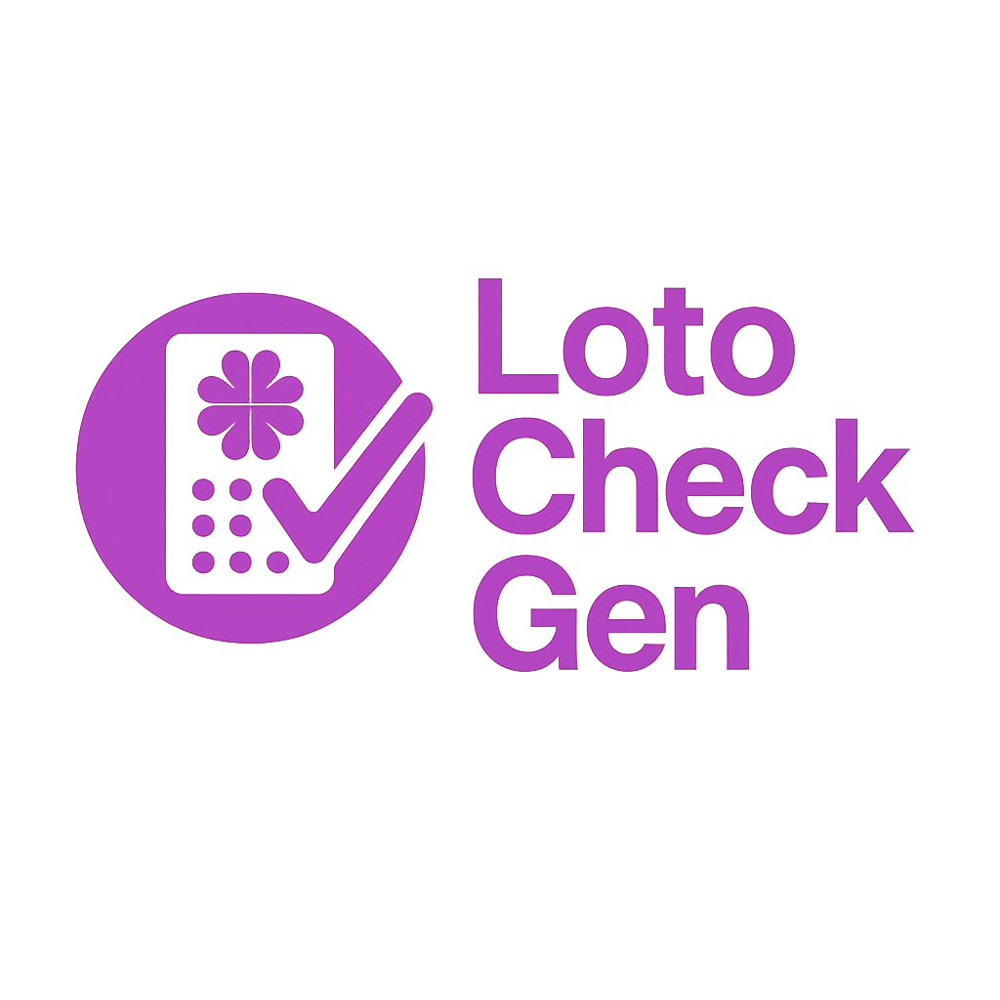

<h1 align="center"></h1>

 

 

<h1 align="center"; style="font-weight: bold;">LotoChekGen </h1>

    <a href="#sobre">Sobre</a> • 
    <a href="#how-it-works">Interface e Funcionamento</a> • 
    <a href="#contribuição">Contribuição</a> •
    <a href="#lincença">Licença</a>

<h2 id="sobre">Sobre</h2>
3 - Sobre o Projeto - O que faz e porque foi construído, com oq foi construido

<h2 id="how-it-works">Interface e Funcionamento</h2>
Instrução de Uso - Utilização do Software ou Site (Por GIFs) e Endpoints da API

<h2 id="contribuição">Contribuição</h2>

<h2 id="lincença">Licença</h2>
7 - Licença MIT?